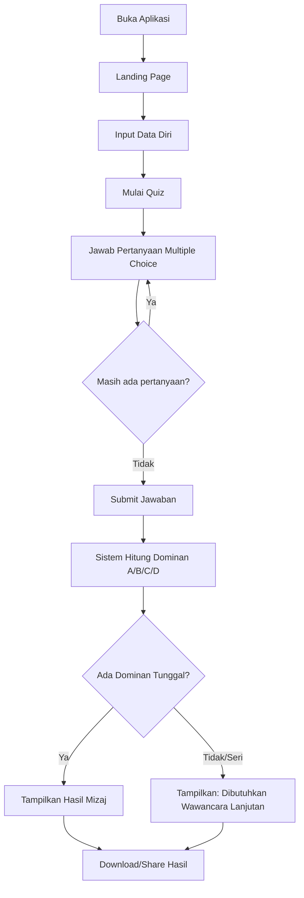
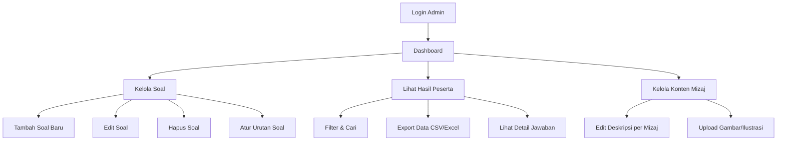
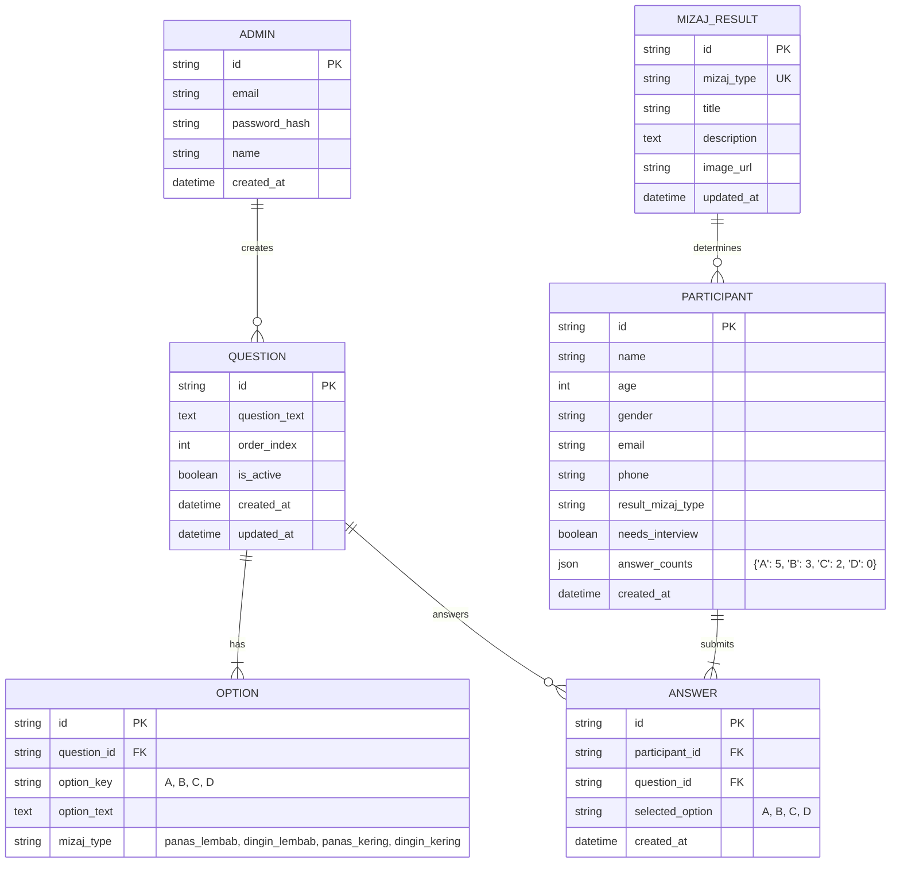

# PRD: Screening Mizaj BioFITRA®

**Versi**: 1.0  
**Tanggal**: 23 Januari 2026  
**Status**: Draft  
**Repository**: https://github.com/add146/Mizaj.git

---

## 1. Ringkasan Produk

| Item | Keterangan |
|------|------------|
| **Nama Aplikasi** | Screening Mizaj BioFITRA® |
| **Target Pengguna** | Usia 12-65 tahun |
| **Masalah** | Mengetahui jenis Mizaj (karakter tubuh sesuai fitrah sejak lahir) untuk ikhtiar penjagaan kesehatan fisik dan mental |
| **Solusi** | Aplikasi kuesioner interaktif dengan hasil analisis otomatis |
| **GitHub** | https://github.com/add146/Mizaj.git |
| **Deployment** | Cloudflare Pages (connect via GitHub) |

---

## 2. User Flow

### 2.1 Flow Pengguna (Peserta Quiz)



**Langkah Detail:**

1. **Akses Aplikasi** → Pengguna membuka URL aplikasi
2. **Landing Page** → Melihat penjelasan singkat tentang Mizaj dan manfaat screening
3. **Isi Data Diri** → Nama, Usia, Jenis Kelamin, Email/WhatsApp (opsional)
4. **Mulai Quiz** → Klik tombol "Mulai Screening"
5. **Menjawab Pertanyaan** → Pilih A, B, C, atau D untuk setiap pertanyaan
6. **Navigasi** → Bisa melihat progress, kembali ke soal sebelumnya
7. **Submit** → Setelah semua pertanyaan dijawab, submit jawaban
8. **Lihat Hasil** → Sistem menampilkan jenis Mizaj dominan beserta uraian lengkap
9. **Simpan/Bagikan** → Download PDF hasil atau share via WhatsApp

### 2.2 Flow Admin



**Langkah Detail:**

1. **Login** → Masuk dengan email & password
2. **Dashboard** → Melihat statistik: total peserta, distribusi hasil Mizaj
3. **Kelola Soal** → CRUD pertanyaan dengan opsi jawaban A, B, C, D
4. **Kelola Konten** → Edit deskripsi hasil untuk masing-masing Mizaj
5. **Lihat Data** → Akses data peserta dan jawaban mereka
6. **Export** → Download data dalam format CSV/Excel

---

## 3. Data Structure

### 3.1 Entity Relationship Diagram



### 3.2 Tabel Database (D1/SQLite)

#### `admins`
| Column | Type | Description |
|--------|------|-------------|
| id | TEXT | Primary Key (UUID) |
| email | TEXT | Email unik untuk login |
| password_hash | TEXT | Password terenkripsi |
| name | TEXT | Nama admin |
| created_at | INTEGER | Timestamp |

#### `questions`
| Column | Type | Description |
|--------|------|-------------|
| id | TEXT | Primary Key (UUID) |
| question_text | TEXT | Teks pertanyaan (bisa panjang) |
| order_index | INTEGER | Urutan tampil |
| is_active | INTEGER | 1=aktif, 0=nonaktif |
| created_at | INTEGER | Timestamp |
| updated_at | INTEGER | Timestamp |

#### `options`
| Column | Type | Description |
|--------|------|-------------|
| id | TEXT | Primary Key (UUID) |
| question_id | TEXT | Foreign Key ke questions |
| option_key | TEXT | A, B, C, atau D |
| option_text | TEXT | Teks pilihan jawaban (bisa panjang) |
| mizaj_type | TEXT | panas_lembab / dingin_lembab / panas_kering / dingin_kering |

#### `mizaj_results`
| Column | Type | Description |
|--------|------|-------------|
| id | TEXT | Primary Key (UUID) |
| mizaj_type | TEXT | Unique: panas_lembab, dingin_lembab, panas_kering, dingin_kering |
| title | TEXT | Judul display (Panas Lembab, dll) |
| description | TEXT | Uraian lengkap per Mizaj |
| image_url | TEXT | URL gambar ilustrasi (R2) |
| updated_at | INTEGER | Timestamp |

#### `participants`
| Column | Type | Description |
|--------|------|-------------|
| id | TEXT | Primary Key (UUID) |
| name | TEXT | Nama peserta |
| age | INTEGER | Usia |
| gender | TEXT | Jenis kelamin |
| email | TEXT | Email (opsional) |
| phone | TEXT | No. WhatsApp (opsional) |
| result_mizaj_type | TEXT | Hasil Mizaj dominan |
| needs_interview | INTEGER | 1 jika hasil seri |
| answer_counts | TEXT | JSON: {"A": 5, "B": 3, "C": 2, "D": 0} |
| created_at | INTEGER | Timestamp |

#### `answers`
| Column | Type | Description |
|--------|------|-------------|
| id | TEXT | Primary Key (UUID) |
| participant_id | TEXT | FK ke participants |
| question_id | TEXT | FK ke questions |
| selected_option | TEXT | A, B, C, atau D |
| created_at | INTEGER | Timestamp |

---

## 4. Tech Stack

### 4.1 Arsitektur Cloudflare

```
┌─────────────────────────────────────────────────────────────┐
│                    CLOUDFLARE ECOSYSTEM                      │
├─────────────────────────────────────────────────────────────┤
│                                                             │
│  ┌─────────────────┐    ┌─────────────────────────────┐   │
│  │ Cloudflare      │    │ Cloudflare Workers (API)    │   │
│  │ Pages           │───▶│ - Hono Framework            │   │
│  │ (React/Vite)    │    │ - JWT Authentication        │   │
│  └─────────────────┘    │ - Business Logic            │   │
│                          └───────────┬─────────────────┘   │
│                                      │                      │
│                    ┌─────────────────┼─────────────────┐   │
│                    │                 │                 │   │
│                    ▼                 ▼                 ▼   │
│  ┌─────────────────┐  ┌─────────────────┐  ┌──────────┐  │
│  │ Cloudflare D1   │  │ Cloudflare R2   │  │ KV       │  │
│  │ (SQLite DB)     │  │ (Object Storage)│  │ (Cache)  │  │
│  │ - Questions     │  │ - Images        │  │ - Session│  │
│  │ - Participants  │  │ - PDF Results   │  │          │  │
│  │ - Results       │  │                 │  │          │  │
│  └─────────────────┘  └─────────────────┘  └──────────┘  │
│                                                             │
└─────────────────────────────────────────────────────────────┘
```

### 4.2 Detail Stack

| Layer | Technology | Keterangan |
|-------|------------|------------|
| **Frontend** | React + Vite | SPA modern, fast build |
| **Styling** | Tailwind CSS | Utility-first, responsive |
| **Backend API** | Cloudflare Workers + Hono | Serverless, edge computing |
| **Database** | Cloudflare D1 | SQLite di edge, gratis tier generous |
| **File Storage** | Cloudflare R2 | S3-compatible, no egress fees |
| **Session/Cache** | Cloudflare KV | Key-value storage untuk session |
| **Authentication** | JWT + bcrypt | Stateless auth untuk admin |
| **PDF Generator** | jsPDF / @react-pdf | Generate hasil dalam PDF |

### 4.3 Struktur Project

```
quizoner/
├── web/                          # Frontend (Cloudflare Pages)
│   ├── src/
│   │   ├── components/
│   │   │   ├── ui/               # Reusable UI components
│   │   │   ├── quiz/             # Quiz-related components
│   │   │   └── admin/            # Admin panel components
│   │   ├── pages/
│   │   │   ├── public/           # Landing, Quiz, Result
│   │   │   └── admin/            # Dashboard, Questions, etc
│   │   ├── lib/
│   │   │   ├── api.ts            # API client
│   │   │   └── utils.ts          # Helper functions
│   │   └── App.tsx
│   ├── package.json
│   └── vite.config.ts
│
├── api/                          # Backend (Cloudflare Workers)
│   ├── src/
│   │   ├── routes/
│   │   │   ├── auth.ts           # Login, register
│   │   │   ├── questions.ts      # CRUD soal
│   │   │   ├── quiz.ts           # Submit & calculate
│   │   │   ├── participants.ts   # Data peserta
│   │   │   └── mizaj.ts          # Konten hasil Mizaj
│   │   ├── middleware/
│   │   │   └── auth.ts           # JWT verification
│   │   ├── lib/
│   │   │   └── db.ts             # D1 helpers
│   │   └── index.ts              # Hono app entry
│   ├── schema.sql                # Database schema
│   ├── package.json
│   └── wrangler.toml             # Cloudflare config
│
└── README.md
```

---

## 5. Saran UI/UX

### 5.1 Prinsip Desain untuk Target Usia 12-65 Tahun

> [!IMPORTANT]
> Rentang usia luas memerlukan desain yang **aksesibel** dan **universal**.

| Aspek | Rekomendasi |
|-------|-------------|
| **Font Size** | Minimal 16px body, 20px+ untuk headline |
| **Kontras** | Ratio minimal 4.5:1 (WCAG AA) |
| **Touch Target** | Minimal 44x44px untuk tombol |
| **Bahasa** | Bahasa Indonesia yang mudah dipahami |
| **Progress** | Selalu tampilkan progress quiz (soal ke-X dari Y) |

### 5.2 Color Palette

```css
/* Tema Kesehatan & Natural */
:root {
  --primary: #2E7D32;        /* Hijau natural - kesehatan */
  --primary-light: #60AD5E;
  --secondary: #1565C0;      /* Biru tenang */
  --accent: #FF8F00;         /* Oranye hangat */
  --background: #FAFAFA;
  --surface: #FFFFFF;
  --text-primary: #212121;
  --text-secondary: #757575;
  
  /* Warna per Mizaj */
  --mizaj-panas-lembab: #FF7043;    /* Oranye hangat */
  --mizaj-dingin-lembab: #42A5F5;   /* Biru sejuk */
  --mizaj-panas-kering: #EF5350;    /* Merah api */
  --mizaj-dingin-kering: #78909C;   /* Abu-abu dingin */
}
```

### 5.3 Wireframe Konsep

#### Landing Page
```
┌─────────────────────────────────────────┐
│  🌿 Screening Mizaj BioFITRA®           │
├─────────────────────────────────────────┤
│                                         │
│      [ Ilustrasi 4 Tipe Mizaj ]         │
│                                         │
│  ┌─────────────────────────────────┐   │
│  │  Kenali Karakter Tubuh Anda     │   │
│  │  Sesuai Fitrah Sejak Lahir      │   │
│  └─────────────────────────────────┘   │
│                                         │
│        [ 🚀 MULAI SCREENING ]           │
│                                         │
│  ✓ Gratis  ✓ 5 Menit  ✓ Hasil Langsung │
│                                         │
└─────────────────────────────────────────┘
```

#### Quiz Interface
```
┌─────────────────────────────────────────┐
│  Soal 3 dari 10            [=========  ] │
├─────────────────────────────────────────┤
│                                         │
│  Bagaimana kondisi kulit Anda secara    │
│  umum sepanjang tahun?                  │
│                                         │
│  ┌─────────────────────────────────┐   │
│  │ ○ A. Berminyak dan lembab       │   │
│  └─────────────────────────────────┘   │
│  ┌─────────────────────────────────┐   │
│  │ ○ B. Normal cenderung lembab    │   │
│  └─────────────────────────────────┘   │
│  ┌─────────────────────────────────┐   │
│  │ ○ C. Kering dan kasar           │   │
│  └─────────────────────────────────┘   │
│  ┌─────────────────────────────────┐   │
│  │ ○ D. Sangat kering, mudah pecah │   │
│  └─────────────────────────────────┘   │
│                                         │
│  [ ← Sebelumnya ]      [ Selanjutnya → ]│
└─────────────────────────────────────────┘
```

#### Hasil Quiz
```
┌─────────────────────────────────────────┐
│         🎉 HASIL SCREENING ANDA         │
├─────────────────────────────────────────┤
│                                         │
│      ┌─────────────────────────┐       │
│      │   🔥 PANAS LEMBAB       │       │
│      │   (Sanguinis/Damawi)    │       │
│      └─────────────────────────┘       │
│                                         │
│  ┌─────────────────────────────────┐   │
│  │ Distribusi Jawaban:              │   │
│  │ A (Panas Lembab)   : ████████ 8  │   │
│  │ B (Dingin Lembab)  : ███ 3       │   │
│  │ C (Panas Kering)   : █ 1         │   │
│  │ D (Dingin Kering)  : ██ 2        │   │
│  └─────────────────────────────────┘   │
│                                         │
│  [ Uraian Lengkap Mizaj Panas Lembab ] │
│  Lorem ipsum dolor sit amet...          │
│                                         │
│  [ 📥 Download PDF ]  [ 📤 Bagikan ]   │
└─────────────────────────────────────────┘
```

### 5.4 UX Guidelines

1. **One Question Per Screen** → Fokus, tidak overwhelming
2. **Auto-save Jawaban** → Tidak hilang jika refresh
3. **Keyboard Navigation** → Bisa pakai angka 1-4 untuk pilih
4. **Mobile First** → 70%+ user akan akses via HP
5. **Hasil Positif** → Framing yang membangun, bukan judgmental
6. **No Account Required** → Peserta tidak perlu registrasi

### 5.5 Accessibility Checklist

- [ ] Alt text untuk semua gambar
- [ ] Focus states yang jelas
- [ ] Skip navigation untuk screen reader
- [ ] Reduced motion option
- [ ] Readable dalam mode gelap (opsional)

---

## 6. Fitur Acak Jawaban (Shuffle Answers)

### 6.1 Konsep

> [!IMPORTANT]
> Urutan jawaban A, B, C, D bisa diacak untuk mencegah pola jawaban yang mudah ditebak, **namun setiap jawaban tetap membawa unsur Mizaj-nya masing-masing**.

| Setting | Keterangan |
|---------|------------|
| **Toggle ON** | Urutan jawaban diacak setiap kali soal ditampilkan |
| **Toggle OFF** | Urutan jawaban tetap sesuai input admin (A, B, C, D) |

### 6.2 Cara Kerja

```
Contoh Soal: "Bagaimana kondisi kulit Anda?"

=== ADMIN INPUT (Urutan Asli) ===
A. Berminyak dan lembab      → [Panas Lembab]
B. Normal cenderung lembab   → [Dingin Lembab]  
C. Kering dan kasar          → [Panas Kering]
D. Sangat kering, pecah-pecah → [Dingin Kering]

=== TAMPILAN USER (Shuffle ON) ===
1. Sangat kering, pecah-pecah  ← (tetap Dingin Kering)
2. Berminyak dan lembab        ← (tetap Panas Lembab)
3. Normal cenderung lembab     ← (tetap Dingin Lembab)
4. Kering dan kasar            ← (tetap Panas Kering)
```

**Penting**: Label A/B/C/D hanya untuk urutan tampilan. Yang disimpan adalah `mizaj_type`, bukan huruf.

### 6.3 Admin UI - Form Tambah/Edit Soal

```
┌─────────────────────────────────────────────────────────────┐
│  📝 TAMBAH SOAL BARU                                        │
├─────────────────────────────────────────────────────────────┤
│                                                             │
│  Pertanyaan:                                                │
│  ┌─────────────────────────────────────────────────────┐   │
│  │ Bagaimana kondisi kulit Anda secara umum?           │   │
│  └─────────────────────────────────────────────────────┘   │
│                                                             │
│  ─────────────────────────────────────────────────────────  │
│                                                             │
│  🔥 Jawaban untuk PANAS LEMBAB (Sanguinis):                │
│  ┌─────────────────────────────────────────────────────┐   │
│  │ Berminyak dan lembab sepanjang tahun                │   │
│  └─────────────────────────────────────────────────────┘   │
│  💧 Placeholder: Ciri khas panas & lembab                  │
│                                                             │
│  ─────────────────────────────────────────────────────────  │
│                                                             │
│  ❄️ Jawaban untuk DINGIN LEMBAB (Phlegmatis):              │
│  ┌─────────────────────────────────────────────────────┐   │
│  │ Normal, cenderung lembab dan halus                  │   │
│  └─────────────────────────────────────────────────────┘   │
│  💧 Placeholder: Ciri khas dingin & lembab                 │
│                                                             │
│  ─────────────────────────────────────────────────────────  │
│                                                             │
│  🔥 Jawaban untuk PANAS KERING (Koleris):                  │
│  ┌─────────────────────────────────────────────────────┐   │
│  │ Kering dan kasar, mudah iritasi                     │   │
│  └─────────────────────────────────────────────────────┘   │
│  💧 Placeholder: Ciri khas panas & kering                  │
│                                                             │
│  ─────────────────────────────────────────────────────────  │
│                                                             │
│  ❄️ Jawaban untuk DINGIN KERING (Melankolis):              │
│  ┌─────────────────────────────────────────────────────┐   │
│  │ Sangat kering, pecah-pecah, bersisik                │   │
│  └─────────────────────────────────────────────────────┘   │
│  💧 Placeholder: Ciri khas dingin & kering                 │
│                                                             │
│  ─────────────────────────────────────────────────────────  │
│                                                             │
│  ⚙️ Pengaturan:                                            │
│  ┌──────────────────────────────────────────────┐          │
│  │ 🔀 Acak Urutan Jawaban   [====●] ON          │          │
│  └──────────────────────────────────────────────┘          │
│                                                             │
│            [ 💾 Simpan Soal ]    [ ❌ Batal ]              │
│                                                             │
└─────────────────────────────────────────────────────────────┘
```

### 6.4 Panduan Placeholder per Mizaj

| Mizaj Type | Icon | Karakteristik Umum (Helper Text) |
|------------|------|----------------------------------|
| **Panas Lembab** | 🔥💧 | Hangat, berminyak, aktif, cepat, emosional |
| **Dingin Lembab** | ❄️💧 | Sejuk, lembab, tenang, lambat, sabar |
| **Panas Kering** | 🔥🏜️ | Hangat, kering, tegas, cepat marah, enerjik |
| **Dingin Kering** | ❄️🏜️ | Dingin, kering, analitis, pendiam, perfeksionis |

### 6.5 Update Data Structure

#### Tambahan kolom di tabel `questions`:

| Column | Type | Description |
|--------|------|-------------|
| shuffle_options | INTEGER | 1=acak urutan, 0=urutan tetap (default: 1) |

#### Update tabel `options` - Tidak perlu `option_key`:

| Column | Type | Description |
|--------|------|-------------|
| id | TEXT | Primary Key (UUID) |
| question_id | TEXT | Foreign Key ke questions |
| mizaj_type | TEXT | **PRIMARY KEY for logic**: panas_lembab / dingin_lembab / panas_kering / dingin_kering |
| option_text | TEXT | Teks pilihan jawaban |

> [!NOTE]
> Kolom `option_key` (A/B/C/D) dihapus karena tidak relevan lagi. Yang penting adalah `mizaj_type`.

### 6.6 Logika Shuffle di Frontend

```javascript
function getShuffledOptions(question) {
  const options = [...question.options]; // Copy array
  
  if (question.shuffle_options) {
    // Fisher-Yates shuffle
    for (let i = options.length - 1; i > 0; i--) {
      const j = Math.floor(Math.random() * (i + 1));
      [options[i], options[j]] = [options[j], options[i]];
    }
  }
  
  return options;
}

// Saat user memilih jawaban, simpan mizaj_type bukan posisi
function handleSelectOption(option) {
  setAnswer({
    question_id: currentQuestion.id,
    selected_mizaj: option.mizaj_type  // 'panas_lembab', etc.
  });
}
```

---

## 7. Logika Perhitungan Hasil

```javascript
function calculateMizaj(answers) {
  const counts = { 
    panas_lembab: 0, 
    dingin_lembab: 0, 
    panas_kering: 0, 
    dingin_kering: 0 
  };
  
  // Hitung jumlah masing-masing mizaj type
  answers.forEach(answer => {
    counts[answer.selected_mizaj]++;
  });
  
  // Cari nilai maksimum
  const maxCount = Math.max(...Object.values(counts));
  
  // Cari semua mizaj dengan nilai maksimum
  const dominants = Object.entries(counts)
    .filter(([key, value]) => value === maxCount)
    .map(([key]) => key);
  
  // Jika lebih dari satu dominan (seri)
  if (dominants.length > 1) {
    return {
      needsInterview: true,
      mizajType: null,
      message: "Dibutuhkan Wawancara Lanjutan",
      counts
    };
  }
  
  return {
    needsInterview: false,
    mizajType: dominants[0],
    counts
  };
}

// Mapping untuk display
const mizajDisplay = {
  panas_lembab: { title: 'Panas Lembab', subtitle: 'Sanguinis/Damawi', icon: '🔥💧' },
  dingin_lembab: { title: 'Dingin Lembab', subtitle: 'Phlegmatis/Balghami', icon: '❄️💧' },
  panas_kering: { title: 'Panas Kering', subtitle: 'Koleris/Shafrawi', icon: '🔥🏜️' },
  dingin_kering: { title: 'Dingin Kering', subtitle: 'Melankolis/Saudawi', icon: '❄️🏜️' }
};
```

---

## 7. Milestone & Timeline (Estimasi)

| Fase | Durasi | Deliverables |
|------|--------|--------------|
| **Setup** | 1 hari | Project structure, Cloudflare setup, D1 schema |
| **Backend API** | 2-3 hari | Auth, CRUD Questions, Quiz logic, Results |
| **Admin Panel** | 2-3 hari | Dashboard, Kelola Soal, Kelola Mizaj, Data Peserta |
| **Public Quiz** | 2-3 hari | Form data diri, Quiz interface, Hasil |
| **Polish** | 1-2 hari | Responsive, Testing, PDF Export |
| **Deploy** | 1 hari | Cloudflare deployment, Domain setup |

**Total Estimasi: 9-13 hari kerja**

---

## 8. Pertanyaan untuk Klarifikasi

> [!NOTE]
> Sebelum implementasi, mohon konfirmasi hal berikut:

1. **Jumlah Soal** → Berapa perkiraan jumlah soal yang akan dibuat?
2. **Multi-admin** → Apakah perlu fitur multiple admin dengan role berbeda?
3. **Email Notifikasi** → Apakah hasil perlu dikirim ke email peserta?
4. **Branding** → Apakah sudah ada logo dan brand guideline?
5. **Domain** → Apakah sudah ada domain yang disiapkan?
6. **Materi Konten** → Apakah materi soal dan deskripsi Mizaj sudah siap?

---

**Dokumen ini siap untuk direview dan diimplementasikan setelah klarifikasi di atas dijawab.**
